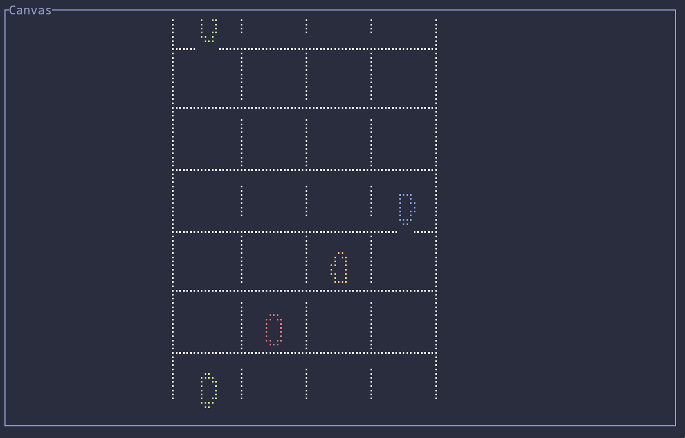

# Rust MIDI Chart Reader 

A simple MIDI chart reader/transformer to YARG Lanes written in Rust.

## Roadmap 

- [ ] Read MIDI file
  - [ ] Parse Instruments
  - [ ] Parse Events Sections
  - [ ] Convert to Music Sheet
- [ ] Modes
  - [ ] Music Sheet Viewer
  - [x] Chart Viewer
    - [x] Four Lanes
    - [x] Five Lanes

## Usage

This app still in development, but you can run it by:
```bash
cargo run
```

## Commands 

- `q` - Quit the app
- `a` - Increase Speed
- `s` - Decrease Speed
- `d` - Increase Position
- `f` - Decrease Position

## Issues

* Shrink and expand the lane height by changing the `height` property in the `lane` object still a problem.

## License

Copyright (c) danielhe4rt <danielhe4rt@gmail.com>

This project is licensed under the MIT license ([LICENSE] or <http://opensource.org/licenses/MIT>)

[LICENSE]: ./LICENSE
